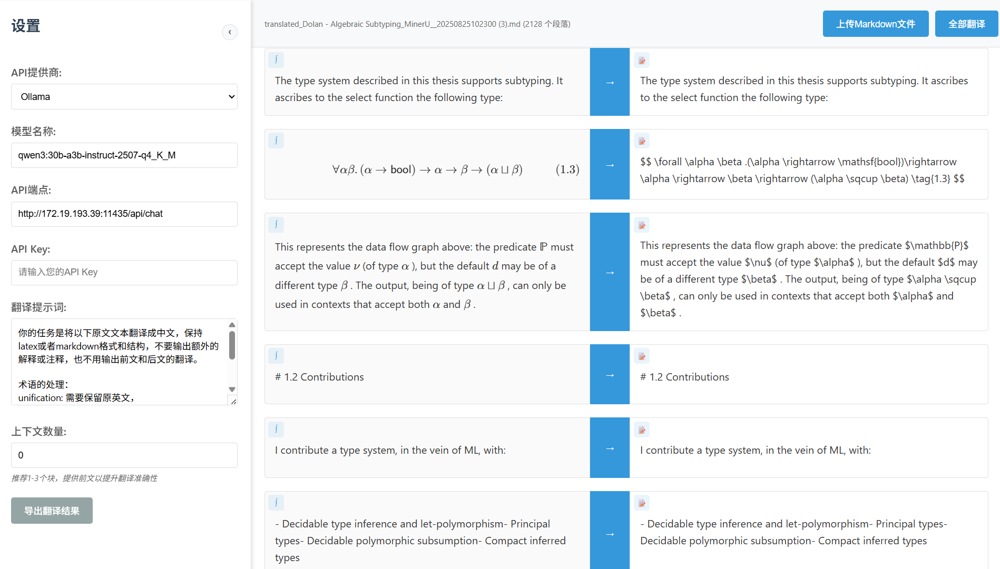

# Markdown 在线翻译工具

一个基于大语言模型（LLM）API的 Markdown/Latex 文章翻译工具。逐段翻译 Markdown 内容同时直接校对。支持数学公式

由于HTTP网页仅能发送HTTP请求，HTTPS网页仅能发送HTTPS请求：建议本地OLLAMA等HTTP API使用HTTP链接，其他的HTTPS API使用HTTPS链接。

HTTP： http://wjk.moe/markdown-translate-online/

HTTPS： https://wjk.moe/markdown-translate-online/

推荐的本地模型：OLLAMA的qwen3:30b-a3b-instruct-2507-q4_K_M  （2025年9月2日）

推荐的Prompt形式：（上下文数量设置为0）

```
你的任务是将以下原文文本翻译成中文，保持latex或者markdown格式和结构，不要输出额外的解释或注释，也不用输出前文和后文的翻译。

术语的处理：
unification: 需要保留原英文，
biunifucation: 需要保留原始英文，
contravariant: 翻译为“逆变”，
soundness需要保留原英文，
preorder 翻译为 “前序”
monotype environment 翻译为单态类型环境
```

## 截图



## 功能

- **纯前端解决方案**：无需后端支持，完全在浏览器中运行
- **分块翻译**：将 Markdown 内容分割为可管理的段落进行翻译
- **实时编辑**：可直接编辑原文和译文内容
- **可自定义提示词**：根据需求配置翻译提示词

## 快速开始

1. **打开应用**：在浏览器中打开 `index.html` 文件
2. **配置 API 设置**：
   - 选择 LLM 提供商（OpenAI/Anthropic/Ollama/自定义）
   - 输入您的 API 密钥
   - 如需要可自定义翻译提示词
3. **上传 Markdown 文件**：点击"上传Markdown文件"选择您的 `.md` 文件
4. **开始翻译**：点击单个翻译按钮或使用"全部翻译"进行批量翻译
5. **导出结果**：使用导出按钮下载翻译后的 Markdown 文件
