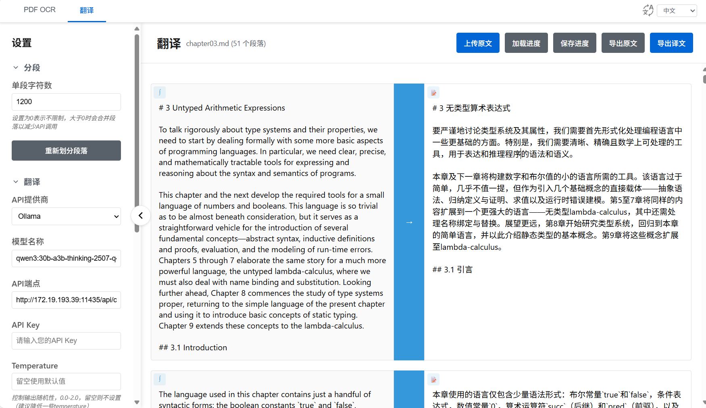

# Latexdiff工具站

## PDF OCR 识别


- SOTA高准确度的OCR识别：基于[准确度远超其他方案](https://github.com/rednote-hilab/dots.ocr?tab=readme-ov-file#benchmark-results)的dots.ocr模型API，支持使用docker一键启动API端点：https://github.com/am009/dots.ocr
   - 自动过滤页眉页脚
- 双栏展示，迅速校对：双列展示pdf页面和OCR结果，鼠标悬停高亮对应页面文本区域，可直接编辑结果。

### 特性

- 页面纯静态，纯本地化部署，完全开源。

## Markdown/Latex 在线翻译工具

一个基于大语言模型（LLM）API的 Markdown/Latex 文章翻译工具。逐段翻译 Markdown/Latex 内容同时直接校对。支持数学公式

建议本地OLLAMA等HTTP API使用HTTP链接，其他的HTTPS API使用HTTPS链接。（HTTP网页仅能发送HTTP的API请求，HTTPS网页仅能发送HTTPS的API请求）

HTTP： http://tool.latexdiff.cn/

HTTPS： https://tool.latexdiff.cn/

<!-- 
推荐的翻译Prompt形式：（上下文数量设置为0）

```
你的任务是将以下原文文本翻译成中文，保持latex或者markdown格式和结构，不要输出额外的解释或注释，也不用输出前文和后文的翻译。

术语的处理：
unification: 需要保留原英文，
biunifucation: 需要保留原始英文，
contravariant: 翻译为“逆变”，
soundness需要保留原英文，
preorder 翻译为 “前序”
monotype environment 翻译为单态类型环境
``` -->



### 特性

- **逐段翻译与校对**：点击蓝色箭头按钮即可翻译当前段落，然后可以在右侧实时编辑，
- **支持公式渲染**：同时点击小图标可以查看公式渲染结果。

### 快速开始

1. **打开应用**：在浏览器中打开 https://tool.latexdiff.cn/  如果使用Ollama则打开： http://tool.latexdiff.cn/
2. **配置 API 设置**：
   - 选择 LLM 提供商（OpenAI/Anthropic/Ollama/自定义）
   - 配置模型，APIKey等。
   - 自定义翻译提示词
3. **上传 Markdown/Latex 文件**：点击"上传文件"选择待翻译文件。只要是连续两个换行分割的文本都支持。
4. **保存和加载进度**：点击保存进度，可以将当前翻译进度保存为json文件，后续选择该文件即可完全恢复进度。
4. **开始翻译**：点击单个翻译按钮或使用"全部翻译"进行批量翻译
5. **导出结果**：使用导出按钮下载翻译后的 Markdown 文件

### 特点

- **纯静态网页**：完全在浏览器中运行
- **分块翻译**：将 Markdown 内容分割为可管理的段落进行翻译
- **实时编辑**：可直接编辑原文和译文内容
- **可自定义提示词**：根据需求配置翻译提示词

### Q&A

- 问：为什么没有按照我想要的方式分割段落？段落分割方式是什么？
- 答：根据 “连续的两个换行” 分割段落。只有空格和tab的行也看作单独的空行。
- 问：怎么卡死了，半天没有反应？
- 答：如果文本量特别大，而且存在大量数学公式，确实会出现MathJax公式渲染慢的问题。可以多等一等。

### 其他：

- Ollama推荐的模型：qwen3:30b-a3b-thinking-2507-q4_K_M  （2025年9月2日）
